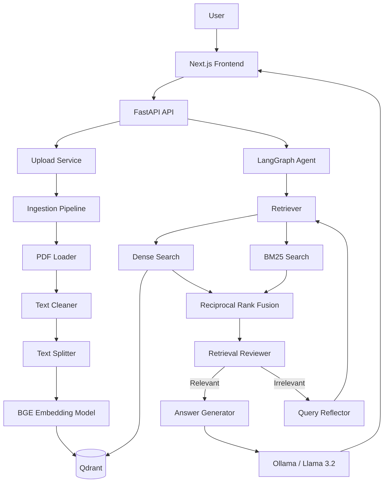

# SAGE — Self-Adaptive Generative Engine

> **An agentic RAG system that doesn't blindly trust its first retrieval.**

SAGE (**Self-Adaptive Generative Engine**) is a production-oriented Retrieval-Augmented Generation (RAG) system designed to **evaluate retrieval quality, adapt failed searches, and generate grounded answers from an indexed knowledge base**.

Instead of following a fixed:

```text
Question → Retrieve → Generate
```

pipeline, SAGE uses an adaptive agent workflow:

```text
Question
   │
   ▼
Retrieve
   │
   ▼
Review Retrieval Quality
   │
   ├── Relevant ───────────────► Generate Answer
   │
   └── Irrelevant
          │
          ▼
     Rewrite Query
          │
          ▼
       Retrieve
          │
          └── Retry (up to 3 times)
```

The goal is simple: **when retrieval fails, SAGE should recognize the failure and try a better search instead of generating an answer from poor context.**

---

## ✨ Key Features

- 📄 **PDF knowledge ingestion**
- 🧹 Text cleaning and recursive chunking
- 🧠 **BGE semantic embeddings** using `BAAI/bge-small-en-v1.5`
- 🗄️ **Qdrant vector database** for persistent semantic retrieval
- 🔎 **Hybrid retrieval**
  - Dense semantic search
  - BM25 keyword search
  - Reciprocal Rank Fusion (RRF)
- 🤖 **LangGraph-based agent workflow**
- 🔍 **Retrieval quality evaluation**
  - Similarity-score pre-filter
  - LLM-based relevance grading
- 🔄 **Self-adaptive query rewriting**
- ♻️ Automatic retrieval retries when context is irrelevant
- 🦙 Local LLM inference through **Ollama**
- 📡 **Server-Sent Events (SSE)** for real-time workflow updates
- ⚡ FastAPI backend
- 💻 Next.js frontend
- 🐳 Dockerized Qdrant infrastructure

---

## 🧠 Why SAGE?

Traditional RAG systems generally assume:

> "If retrieval returned documents, those documents must be useful."

That assumption can produce hallucinations, irrelevant context, and poor answers.

SAGE introduces a feedback loop:

```text
          ┌─────────────────────┐
          │      User Query     │
          └──────────┬──────────┘
                     │
                     ▼
          ┌─────────────────────┐
          │ Hybrid Retrieval   │
          │                     │
          │ Dense + BM25 + RRF  │
          └──────────┬──────────┘
                     │
                     ▼
          ┌─────────────────────┐
          │ Retrieval Reviewer  │
          └──────────┬──────────┘
                     │
             ┌───────┴────────┐
             │                │
          Relevant         Irrelevant
             │                │
             ▼                ▼
       ┌───────────┐   ┌──────────────┐
       │ Generate  │   │ Query        │
       │ Answer    │   │ Reflection   │
       └───────────┘   └──────┬───────┘
                              │
                              ▼
                         New Search
```

This makes retrieval an **iterative process rather than a single-shot operation**.

---

# 🏗️ Architecture



---

# 🔄 RAG Pipeline

## 1. Document Ingestion

A PDF uploaded through the API passes through:

```text
PDF
 ↓
Text Extraction
 ↓
Text Cleaning
 ↓
Text Splitting
 ↓
BGE Embeddings
 ↓
Qdrant
```

The ingestion pipeline is implemented as separate loader, cleaner, and splitter components.

Each chunk is stored in Qdrant with metadata such as:

```json
{
  "source_document": "example.pdf",
  "chunk_index": 12,
  "text": "..."
}
```

The embeddings are generated using `BAAI/bge-small-en-v1.5` and normalized before storage.

---

## 2. Hybrid Retrieval

SAGE combines two complementary retrieval strategies.

### Dense Retrieval

The user query is converted into an embedding and searched against Qdrant using cosine similarity.

```text
Query
  ↓
BGE Embedding
  ↓
Qdrant
  ↓
Top semantic matches
```

### Sparse Retrieval

The same query is also searched using **BM25**, which is useful for exact terms, names, technical vocabulary, and keyword-heavy questions.

```text
Query
  ↓
Tokenization
  ↓
BM25
  ↓
Top keyword matches
```

### Reciprocal Rank Fusion

The two result sets are combined using **Reciprocal Rank Fusion (RRF)**:

```text
Dense Results ──┐
                ├──► RRF ──► Ranked Context
BM25 Results ───┘
```

This allows SAGE to benefit from both semantic similarity and lexical matching.

---

# 🤖 Self-Adaptive Agent Workflow

The core of SAGE is implemented using **LangGraph**.

The workflow contains four primary nodes:

```text
Retriever
    │
    ▼
Reviewer
    │
    ├──────────────► Answerer
    │
    ▼
Reflector
    │
    └──────────────► Retriever
```

### Retriever

Retrieves the most relevant chunks using hybrid search.

### Reviewer

Evaluates whether the retrieved context is actually capable of answering the question.

SAGE uses two stages:

**Stage 1 — Similarity threshold**

A retrieved context must first pass a similarity threshold.

```text
Best similarity < 0.65
        │
        ▼
    Rejected
```

**Stage 2 — LLM relevance grading**

Borderline retrievals are evaluated by an LLM that determines whether the documents actually contain the answer.

### Reflector

If retrieval is judged irrelevant, the original question is rewritten into a more retrieval-oriented search query.

For example:

```text
Original:
"What causes vanishing gradients?"

             ↓

Reflected query:
"technical explanation of vanishing gradient
problem in deep neural networks"
```

The rewritten query is then sent back through the retrieval pipeline.

SAGE allows up to **three retrieval retries** before returning a failure response.

### Answerer

Once relevant context has been identified, the answer generator receives only the retrieved context and the original question.

The generation prompt explicitly instructs the model not to invent information outside the retrieved context.

---

# 🧰 Tech Stack

| Component | Technology |
|---|---|
| Backend | FastAPI |
| Agent Orchestration | LangGraph |
| RAG Framework | LangChain |
| Embeddings | BAAI BGE Small |
| Vector Database | Qdrant |
| Sparse Retrieval | BM25 |
| Ranking | Reciprocal Rank Fusion |
| LLM | Ollama |
| Default LLM | Llama 3.2 |
| PDF Processing | PyMuPDF |
| Frontend | Next.js |
| UI | React + Tailwind CSS |
| Language | Python / TypeScript |
| Infrastructure | Docker Compose |

The backend configuration currently defaults to a 384-dimensional BGE embedding space and a Qdrant collection named `sage_knowledge_base`.

---

# 📁 Project Structure

```text
SAGE-Self-Adaptive-Generative-Engine/
│
├── backend/
│   │
│   ├── app/
│   │   ├── agent/
│   │   │   ├── nodes.py
│   │   │   ├── state.py
│   │   │   └── workflow.py
│   │   │
│   │   ├── api/
│   │   │   ├── router.py
│   │   │   └── routes/
│   │   │       ├── health.py
│   │   │       ├── upload.py
│   │   │       └── query.py
│   │   │
│   │   ├── ingestion/
│   │   │   ├── loader.py
│   │   │   ├── cleaner.py
│   │   │   ├── splitter.py
│   │   │   └── pipeline.py
│   │   │
│   │   ├── integrations/
│   │   │   ├── embeddings/
│   │   │   │   └── bge.py
│   │   │   ├── vector_db/
│   │   │   │   └── qdrant.py
│   │   │   └── llm/
│   │   │       └── ollama.py
│   │   │
│   │   ├── retrieval/
│   │   │   └── hybrid.py
│   │   │
│   │   ├── services/
│   │   │   ├── upload_service.py
│   │   │   └── query_services.py
│   │   │
│   │   └── core/
│   │       ├── config.py
│   │       └── logger.py
│   │
│   └── pyproject.toml
│
├── frontend/
│   ├── app/
│   ├── components/
│   ├── public/
│   ├── package.json
│   └── ...
│
├── docker-compose.yml
├── .env.example
├── .gitignore
└── README.md
```

---

# 🚀 Getting Started

## Prerequisites

Make sure the following are installed:

- Python **3.14+**
- Node.js
- npm
- Docker
- Ollama

The backend currently declares Python `>=3.14` in `pyproject.toml`.

---

## 1. Clone the Repository

```bash
git clone https://github.com/Dhyanesh-AN/SAGE-Self-Adaptive-Generative-Engine.git

cd SAGE-Self-Adaptive-Generative-Engine
```

---

## 2. Start Qdrant

SAGE uses Qdrant as its vector database.

```bash
docker compose up -d
```

The included Compose configuration exposes:

```text
REST API  → localhost:6333
gRPC API  → localhost:6334
```

and persists Qdrant data using a Docker volume.

Verify that Qdrant is running before starting the backend.

---

## 3. Start Ollama

Install Ollama and pull the default model:

```bash
ollama pull llama3.2
```

Start Ollama if it is not already running:

```bash
ollama serve
```

SAGE currently uses Ollama's local `llama3.2` model by default.

---

## 4. Configure the Backend

Create the environment file:

```bash
cd backend

cp ../.env.example .env
```

The repository currently provides configuration for:

```env
APP_NAME=SAGE
APP_VERSION=1.0.0
DEBUG=true
HOST=0.0.0.0
PORT=8000
LOG_LEVEL=INFO
```

Additional application configuration includes the BGE embedding model and Qdrant connection settings.

---

## 5. Install Backend Dependencies

Using `uv`:

```bash
cd backend

uv sync
```

Or install the project with pip:

```bash
pip install -e .
```

The backend dependencies include FastAPI, LangGraph, LangChain, PyMuPDF, Qdrant Client, Sentence Transformers, BM25, and Uvicorn.

---

## 6. Start the Backend

```bash
uvicorn app.main:app --reload --host 0.0.0.0 --port 8000
```

The API will be available at:

```text
http://localhost:8000
```

Interactive API documentation:

```text
http://localhost:8000/docs
```

---

## 7. Start the Frontend

Open another terminal:

```bash
cd frontend

npm install
npm run dev
```

The Next.js application runs on:

```text
http://localhost:3000
```

The frontend is built with Next.js, React, TypeScript, Tailwind CSS, Framer Motion, and Lucide React.

---

# 📡 API

## Health Check

```http
GET /
```

Response:

```json
{
  "message": "Welcome to SAGE 🚀"
}
```

---

## Service Health

```http
GET /health
```

Response:

```json
{
  "status": "healthy"
}
```

---

## Upload PDF

```http
POST /upload/
```

Example:

```bash
curl -X POST \
  -F "file=@document.pdf" \
  http://localhost:8000/upload/
```

The upload endpoint accepts PDF files, runs the ingestion pipeline, generates embeddings, and stores the resulting chunks in Qdrant.

Example response:

```json
{
  "message": "Successfully ingested document into Knowledge Base",
  "file": "document.pdf",
  "chunks_processed": 42
}
```

---

## Query the Knowledge Base

```http
POST /query/
```

Request:

```json
{
  "question": "What is the main contribution of the paper?"
}
```

Example:

```bash
curl -X POST \
  http://localhost:8000/query/ \
  -H "Content-Type: application/json" \
  -d '{"question":"What is the main contribution of the paper?"}'
```

The response contains:

```json
{
  "answer": "...",
  "sources": [...]
}
```

The query endpoint invokes the LangGraph agent workflow rather than simply performing a single vector search.

---

## Streaming Query

SAGE also exposes an SSE endpoint:

```http
GET /query/stream?question=...
```

This allows the frontend to observe agent progress in real time:

```text
Retriever
   ↓
Reviewer
   ↓
Reflector
   ↓
Retriever
   ↓
Reviewer
   ↓
Answerer
```

Example event:

```text
data: {
  "node": "reviewer",
  "status": "✅ Documents are relevant. Generating answer..."
}
```

The streaming implementation emits workflow-node events as the LangGraph execution progresses.

---

# 🔬 Retrieval Strategy

SAGE currently combines:

### Dense Search

```text
BGE Embedding
      ↓
Qdrant
      ↓
Top 5
```

### Sparse Search

```text
BM25
 ↓
Top 5
```

### Fusion

```text
Dense Results
      +
BM25 Results
      ↓
RRF
      ↓
Top 4 Context Chunks
```

The hybrid retriever implements RRF using:

```text
RRF Score = 1 / (k + rank)
```

with `k = 60` by default.

---

# 🛡️ Grounded Generation

SAGE explicitly constrains answer generation to the retrieved context.

Conceptually:

```text
User Question
      +
Retrieved Evidence
      ↓
LLM
      ↓
Grounded Answer
```

If the retrieved evidence does not contain enough information, the system is instructed to avoid fabricating an answer.

If retrieval itself fails, the agent attempts query reformulation before giving up.

---


---

# 📊 Future Evaluation

A major goal of SAGE is to empirically test whether **adaptive retrieval actually improves RAG performance**.

The planned evaluation will compare:

```text
Baseline RAG
Question
   ↓
Dense Retrieval
   ↓
LLM
```

against:

```text
SAGE
Question
   ↓
Hybrid Retrieval
   ↓
Retrieval Review
   ↓
Query Reflection
   ↓
Retry
   ↓
LLM
```

Potential evaluation dimensions:

| Metric | Purpose |
|---|---|
| Context Precision | Are retrieved chunks relevant? |
| Context Recall | Was the necessary evidence retrieved? |
| Faithfulness | Is the answer supported by context? |
| Answer Relevancy | Does the answer address the question? |
| Retrieval Success Rate | How often does the first retrieval succeed? |
| Recovery Rate | How often does reflection recover failed retrieval? |
| Latency | Cost of adaptive retrieval |
| Token Usage | Additional LLM cost from reflection/review |

This will make it possible to measure whether SAGE's self-adaptation provides a meaningful improvement over conventional RAG rather than relying only on qualitative examples.

---

# ⚠️ Current Limitations

SAGE is currently a research/development project rather than a fully hardened production service.

Known limitations include:

- PDF is currently the primary ingestion format.
- BM25's index is rebuilt from Qdrant metadata during querying.
- The current retrieval workflow uses fixed thresholds and retry limits.
- There is currently no formal RAG benchmark suite in the repository.
- Authentication and multi-user isolation are not implemented.
- Ollama must be available locally for generation.
- Embedding and generation models require local model resources.
- Production-scale ingestion and retrieval optimization are still future work.

These limitations are intentional areas for continued development rather than hidden assumptions.

---

# 🎯 Project Objective

SAGE is built around one research question:

> **Can a RAG system improve its own retrieval process by detecting retrieval failure and adapting its search strategy before generating an answer?**

The project therefore focuses not only on **retrieving information**, but on building a system that can:

```text
Retrieve
   ↓
Evaluate
   ↓
Reflect
   ↓
Adapt
   ↓
Retrieve Again
   ↓
Generate
```

This makes SAGE an exploration of **self-adaptive retrieval and agentic RAG architectures**.

---

# 🤝 Contributing

Contributions, experiments, and ideas are welcome.

Potential areas for contribution include:

- Retrieval algorithms
- Reranking
- Query rewriting strategies
- RAG evaluation
- Agent architectures
- Observability
- Performance optimization
- Frontend improvements

---


---

## ⭐ If you find SAGE interesting

Consider starring the repository and following the project as the adaptive retrieval and evaluation pipeline evolves.

**SAGE — Retrieve. Evaluate. Reflect. Adapt. Generate.**
